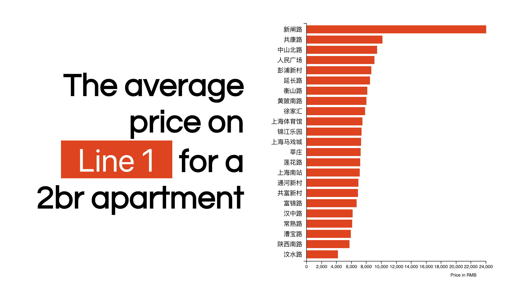

# Technology Enhanced Education Fellowship AY17-18

This is a Github repository for teaching materials, tutorials, prototypes, designs and other project materials used or created during my Technology Enhanced Education Fellowship in AY17-18.

## 1. Teaching materials

In my first teaching position, I taught a total of 16 workshops (12 in-person and 4 online) on various topics ranging from machine learning, through 3D modeling and data visualization. I taught a total of 74 students and gave approximately 14 hours of workshops. Below are some of the materials I used to teach the workshops. 

Initially, I used Google Slides for instructional materials and a structured Lesson Plan document to follow through learning outcomes. I also used a feedback form to learn about what worked and what could be improved. [Link to Google Drive](https://drive.google.com/open?id=1Eh5kqngBjE8lqcEqWAOIxmxmvBNGQJcq)(Requires NYU Login)

Since most of my workshops involved code, for the latest workshops I created a Github page. [Link to Workshops page](http://noelkonagai.github.io/Workshops)

Since data mining and scraping with Python and machine learning with TensorFlow are areas that future TEE Fellows may not be able to teach, I created workshop videos in order to prolong the lifetime of these workshops. [Link to a Sample Video](https://drive.google.com/file/d/1MFJUjOirKecq0NwGO7S0rhyRcTa29qA3/view?usp=sharing)

## 2. Prototypes and Demos

During this fellowship, I not only honed my previous skills related to machine learning, but also developed new skills in AR prototyping and using Unity.

### Shanghai Rent Prediction

The first project I undertook was a step-by-step demonstration of how Python with TensorFlow can help research projects better understand and perhaps even predict future data. I scraped price and apartment data from various sources. I picked Zhongyuan as the source of my data, cleaned the data, engineered features and set up a DNN Regressors model. Link to the [Github repo](https://github.com/noelkonagai/shanghai-apartment), a [summary of findings](http://noelkonagai.co/portfolio/shanghai-apartment-rent-prediction/), and a [sample visualization using D3.js](https://noelkonagai.github.io/shanghai-apartment/)

### MapBox in ARKit

Before this project, I have not developed applications for mobile platform, let alone in Swift. The prototype idea was to create a terrain visualization in AR that could be used as a base for further applications, such as collaborative annotation. 

### Shipin - Vuforia Chinese Product Annotation

This prototype is a spin-off from an object-recognition project made in TensorFlow. More often than not, conventional Chinese classes teach students a limited vocabulary for shopping in China. Dictionaries become obsolete when one is trying to purchase products such as aftershave or teeth-whitening mouthwash. This AR app annotates products and their descriptions and helps customers by suggesting ways of interaction with shop assistants using the Chinese language. This AR prototype demonstrates the horizons along which AR technology can be leveraged for language teaching and learning. This app uses Vuforia and is developed for Android phones. 

## 3. Miscellaneous Projects

### Chinese New Year Animal Badges

In order to improve the image of the NYU Shanghai Library amongst students, I created a number of designs for zodiac animals (and also non-zodiac animals) as promotional badges. They were given to students who filled out a library survey.

Pig                        |  Panda                    | Doge
:-------------------------:|:-------------------------:|:-------------------------:
         |       | 

